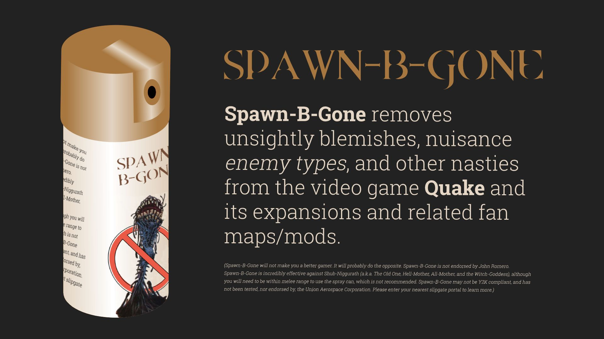

# **Spawn-B-Gone**
+ [What Is It?](#what-is-it)
+ [Why Make It?](#why-make-it)
+ [How Does It Work?](#how-does-it-work)
+ [How Do I Use it?](#how-do-i-use-it)
+ [Download](#2-download-and-setup)
+ [Additional Notes](#additional-notes)

# **What Is It?**
Spawn-B-Gone will remove selected enemy types from maps/levels for the home computer release of the video game [Quake](https://store.steampowered.com/app/2310/QUAKE/), and should also work for any fan made maps or mods such as [Arcane Dimensions](http://www.simonoc.com/pages/design/sp/ad.htm), [Quoth](https://www.quaddicted.com/webarchive/kell.quaddicted.com/quoth/quoth2.html), etc. _(While not tested, it could potentially work for Quake 1 engined based games such as Hexen II for example.)_

# **Why Make It?**
Because I suck at video games.

The original goal was to create something that would allow me to remove [Spawn](https://quake.fandom.com/wiki/Spawn) enemies from any Quake maps. They are by far Quake's worst enemy type (IMO). _([More whining below](#spawns-are-the-worst))_ I didn't want to have to manually determine which map featured them, open said map, edit it, and save each file in a map editor, so I tried to find a code solution that could somewhat automate the process.

After a bit of trial and error while creating these scripts, I realized any enemy type could be removed entirely from maps. So instead of limiting the scripts to just replacing or removing Spawn enemies, I figured it would make more sense to allow the removal of any enemy type. _I thought the name was decently clever though, so I kept it even after changing the scripts focus._

Lastly, this has just been a fun coding exercise (`.bat`/`.sh` file creation) for a game I enjoy playing. I've also learned a bit about how Quake map files are created, compiled, and structured in the process.

# **How Does It Work?**
The scripts are just a glorified find and replace function. They search for a user entered string (Ex: `monster_dguard`) within a Quake `.bsp` map file, and replace the `monster_` prepend with `_removed`.

Quake seems to expect a certain file/lump size for a compiled `.bsp` map file that I'm not familiar enough with, so changing the number of bytes in the file seems to cause Quake to crash when the map is loaded. For example, replacing a monster entity name with another of more or fewer characters (E.g., `monster_zombie` to `monster_dog`), or just outright removing an enemy map entity doesn't work.

_([EntEd](https://www.bspquakeeditor.com/downloads.php) seems to work when removing entities, but I'm not sure how it does it properly, and it also seems to crash when loading larger, more modern fan created maps. If you're aware of how I could get around that issue, feel free to contact me or submit a PR.)_

# **How Do I Use It?**

## **1. Requirements**
### **Mac/Linux**
* [Grep](http://gnuwin32.sourceforge.net/packages/grep.htm)
* [Perl](https://www.perl.org)

### **Windows**
* [Powershell](https://github.com/PowerShell/PowerShell/releases/tag/v7.0.3)

## **2. Download and Setup**
Download either the [spawn-b-gone.sh](Spawn-B-Gone.sh?raw=1) _(Mac/Linux)_ or [spawn-b-gone.bat](Spawn-B-Gone.bat?raw=1) _(Windows)_ script to a directory of your choosing. Preferably wherever the Quake `.bsp` map file(s) that you want to run the replacement on are already located. This is usually a path that looks like one of the following:

```
C:\Quake\MODNAME\maps
C:\Program Files (x86)\Steam\steamapps\common\Quake\MODNAME\maps
```

### **Note: Mac/Linux users**
If you are using `spawn-b-gone.sh`, you will need to make the bash script exectuable, by running the following command in the directory that you placed the script:

```
chmod 755 spawn-b-gone.sh
```

### **Note: Working with `.pak` files**
**If you want to run the replacement on the original games map files or any mods that are contained as a `.pak` file, you will need to export the `.bsp` files from within to a temporary directory, using something like [PakScape](https://gamebanana.com/tools/2548). After running the script, if you are using a modern Quake sourceport, you may be able to leave the extracted `.pak` files as is. If not, then you will then need to import the modified `.bsp` files back into the `.pak` file and save it.**

## **3. Usage**
Run `./spawn-b-gone.sh` _(Mac/Linux)_ or `spawn-b-gone.bat` _(Windows)_ in your terminal from whatever directory you've placed the script in, and then follow the on screen prompts. **This directory must contain the `.bsp` files you want to run the enemy removal on.** E.g.:

```
cd C:\Quake\MODNAME\maps\
Spawn-B-Gone.bat
```

## **4. Reverting**
If any map files had replacements made, you should now have a `MAPNAME.bsp.bak` file(s) for it in the same directory. You should either keep these files as is, or put them somewhere safe, in the event you want to revert back to the original enemy layout.

To use the original map file, just delete the modified one, remove `.bak` from the filename of the backup map, and put it in place of the modified file you deleted.

# **Additional Notes**
## **Does removing enemies from maps break anything?**
Aside from the balance of the map as created by the original desiger, then not in any game breaking way that I've come across so far.

I've tested the changes these scripts make in the original Quake game maps, as well as some fan map packs like [Underdark Overbright](https://www.quaddicted.com/reviews/udob.html) and [Arcane Dimensions](https://www.quaddicted.com/reviews/ad_v1_50final.html), and ran into no issues.

If anything was to "break", I imagine it would be due to part of a maps logic/triggered events being tied to:
* Expecting a specific monster entity type _(E.g., A door only opens if a specific Spawn enemy is killed)_
* Expecting a specific number of enemies on the map (I.e., These scripts will recude a maps total enemy count)

I have yet to play a map with these kinds of triggers or logic. In the event of such an issue (or any other), you could easily revert to the original maps backup file that is generated when the scripts are run.

## **Spawns Are The Worst**
For me personally, I find that they ruin the flow of the game. They seem to have no discernible pattern, unlike every other enemy type, and can be used quite poorly in fan made maps. Coming across them changes the game from a fun run-and-gun shooter, to a corner-creeper, where you have to move slow and poke around corners to take the enemy out before continuing on running and gunning.

## **"get good scrub", "ur nt a l33t gmr", "this ruins my childhood!", etc.**
Thank you for your comments. I will take them under consideration. Please forward any additional insights to [spawn-b-gone@gmail.com](https://www.youtube.com/watch?v=oHg5SJYRHA0).
